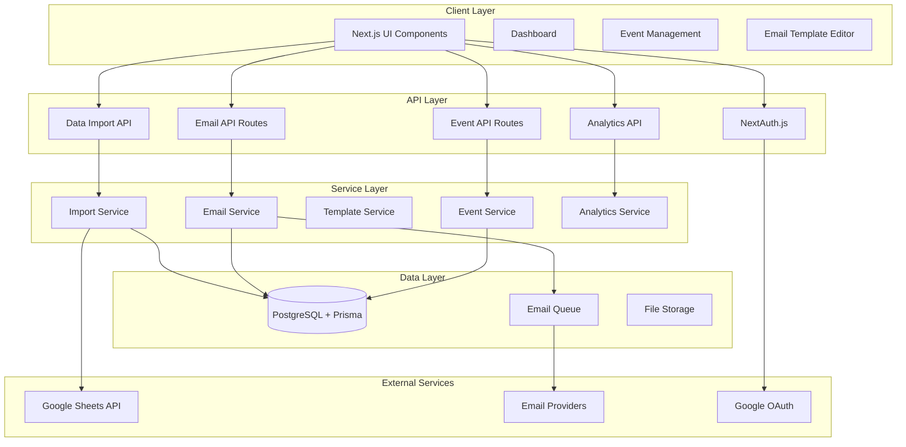

# Design Document: Event Email Automation System

## Overview

The Mailable system is a comprehensive event management and email automation platform built on Next.js 15 with TypeScript. The system enables event organizers to manage events, import participant data from Google Sheets, and execute targeted email campaigns. The architecture leverages modern web technologies including Prisma ORM, NextAuth.js for authentication, and integrates with multiple email service providers for reliable message delivery.

The system follows a modular architecture with clear separation between authentication, event management, data ingestion, email automation, and analytics components. The design emphasizes scalability, reliability, and user experience while maintaining the existing Korean language support and UI patterns.

## Architecture

### High-Level Architecture



### Technology Stack

- **Frontend**: Next.js 15 with App Router, TypeScript, Emotion for styling
- **Backend**: Next.js API Routes, Prisma ORM
- **Database**: PostgreSQL with Prisma migrations
- **Authentication**: NextAuth.js with Google OAuth
- **State Management**: Zustand for client-side state
- **Email Services**: Multi-provider support (SendGrid, AWS SES, Nodemailer)
- **Queue System**: Background job processing for email campaigns
- **External APIs**: Google Sheets API for data import

## Components and Interfaces

### Authentication Component

**Purpose**: Manages user authentication and session handling using NextAuth.js with Google OAuth.

**Key Interfaces**:
```typescript
interface User {
  id: string
  email: string
  name: string
  image?: string
  createdAt: Date
  updatedAt: Date
}

interface Session {
  user: User
  expires: string
}
```

**Responsibilities**:
- Google OAuth integration and token management
- Session validation and refresh
- User profile creation and updates
- Protected route access control

### Event Management Component

**Purpose**: Handles creation, modification, and lifecycle management of events.

**Key Interfaces**:
```typescript
interface Event {
  id: string
  title: string
  date: Date
  place: string
  googleSheetsUrl?: string
  status: EventStatus
  userId: string
  createdAt: Date
  updatedAt: Date
}

enum EventStatus {
  ONGOING = 'ONGOING',
  CLOSED = 'CLOSED'
}

interface EventStatistics {
  totalEvents: number
  ongoingEvents: number
  confirmedParticipants: number
  unconfirmedParticipants: number
}
```

**Responsibilities**:
- Event CRUD operations
- Status management and transitions
- Event statistics calculation
- User access control and ownership validation

### Data Import Component

**Purpose**: Manages importing and processing participant data from Google Sheets CSV sources.

**Key Interfaces**:
```typescript
interface EventData {
  id: string
  eventId: string
  name: string
  email: string
  phone?: string
  status: ParticipantStatus
  customFields: Record<string, any>
  createdAt: Date
  updatedAt: Date
}

enum ParticipantStatus {
  CONFIRMED = 'CONFIRMED',
  UNCONFIRMED = 'UNCONFIRMED',
  CANCELLED = 'CANCELLED'
}

interface ImportResult {
  totalRows: number
  successfulImports: number
  skippedRows: number
  errors: ImportError[]
}
```

**Responsibilities**:
- CSV data parsing and validation
- Duplicate detection and handling
- Batch processing for large datasets
- Error reporting and recovery

### Email Template Component

**Purpose**: Manages creation, editing, and storage of reusable email templates with dynamic content.

**Key Interfaces**:
```typescript
interface EmailTemplate {
  id: string
  name: string
  subject: string
  htmlContent: string
  textContent: string
  placeholders: string[]
  userId: string
  createdAt: Date
  updatedAt: Date
}

interface TemplatePlaceholder {
  key: string
  description: string
  type: 'text' | 'date' | 'number' | 'boolean'
  required: boolean
}
```

**Responsibilities**:
- Rich text template editing
- Dynamic placeholder management
- Template preview with sample data
- Template validation and testing

### Email Campaign Component

**Purpose**: Orchestrates email sending operations with targeting, scheduling, and delivery management.

**Key Interfaces**:
```typescript
interface EmailCampaign {
  id: string
  name: string
  templateId: string
  eventId: string
  targetCriteria: TargetCriteria
  scheduledAt?: Date
  status: CampaignStatus
  userId: string
  createdAt: Date
  updatedAt: Date
}

interface TargetCriteria {
  participantStatus?: ParticipantStatus[]
  customFilters?: Record<string, any>
  excludeList?: string[]
}

enum CampaignStatus {
  DRAFT = 'DRAFT',
  SCHEDULED = 'SCHEDULED',
  SENDING = 'SENDING',
  COMPLETED = 'COMPLETED',
  FAILED = 'FAILED'
}

interface EmailDelivery {
  id: string
  campaignId: string
  recipientEmail: string
  status: DeliveryStatus
  sentAt?: Date
  deliveredAt?: Date
  openedAt?: Date
  clickedAt?: Date
  errorMessage?: string
}
```

**Responsibilities**:
- Campaign creation and configuration
- Participant targeting and filtering
- Email queue management and processing
- Delivery status tracking and retry logic

### Analytics Component

**Purpose**: Provides comprehensive tracking and reporting for email campaign performance and event metrics.

**Key Interfaces**:
```typescript
interface CampaignAnalytics {
  campaignId: string
  totalSent: number
  delivered: number
  opened: number
  clicked: number
  bounced: number
  unsubscribed: number
  deliveryRate: number
  openRate: number
  clickRate: number
}

interface EventAnalytics {
  eventId: string
  participantGrowth: TimeSeriesData[]
  confirmationRate: number
  emailEngagement: CampaignAnalytics[]
}
```

**Responsibilities**:
- Real-time metrics calculation
- Historical data aggregation
- Performance trend analysis
- Export functionality for reporting

## Data Models

### Enhanced Database Schema

Building upon the existing Prisma schema, the enhanced data model includes:

```prisma
model User {
  id            String    @id @default(cuid())
  name          String?
  email         String    @unique
  emailVerified DateTime?
  image         String?
  createdAt     DateTime  @default(now())
  updatedAt     DateTime  @updatedAt
  
  events        Event[]
  templates     EmailTemplate[]
  campaigns     EmailCampaign[]
  accounts      Account[]
  sessions      Session[]
}

model Event {
  id              String      @id @default(cuid())
  title           String
  date            DateTime
  place           String
  googleSheetsUrl String?
  status          EventStatus @default(ONGOING)
  userId          String
  createdAt       DateTime    @default(now())
  updatedAt       DateTime    @updatedAt
  
  user            User        @relation(fields: [userId], references: [id], onDelete: Cascade)
  eventData       EventData[]
  campaigns       EmailCampaign[]
}

model EventData {
  id           String            @id @default(cuid())
  eventId      String
  name         String
  email        String
  phone        String?
  status       ParticipantStatus @default(UNCONFIRMED)
  customFields Json              @default("{}")
  createdAt    DateTime          @default(now())
  updatedAt    DateTime          @updatedAt
  
  event        Event             @relation(fields: [eventId], references: [id], onDelete: Cascade)
  deliveries   EmailDelivery[]
  
  @@unique([eventId, email])
}

model EmailTemplate {
  id           String   @id @default(cuid())
  name         String
  subject      String
  htmlContent  String
  textContent  String
  placeholders String[]
  userId       String
  createdAt    DateTime @default(now())
  updatedAt    DateTime @updatedAt
  
  user         User           @relation(fields: [userId], references: [id], onDelete: Cascade)
  campaigns    EmailCampaign[]
}

model EmailCampaign {
  id             String         @id @default(cuid())
  name           String
  templateId     String
  eventId        String
  targetCriteria Json
  scheduledAt    DateTime?
  status         CampaignStatus @default(DRAFT)
  userId         String
  createdAt      DateTime       @default(now())
  updatedAt      DateTime       @updatedAt
  
  user           User           @relation(fields: [userId], references: [id], onDelete: Cascade)
  template       EmailTemplate  @relation(fields: [templateId], references: [id])
  event          Event          @relation(fields: [eventId], references: [id], onDelete: Cascade)
  deliveries     EmailDelivery[]
}

model EmailDelivery {
  id            String         @id @default(cuid())
  campaignId    String
  participantId String
  recipientEmail String
  status        DeliveryStatus @default(PENDING)
  sentAt        DateTime?
  deliveredAt   DateTime?
  openedAt      DateTime?
  clickedAt     DateTime?
  errorMessage  String?
  createdAt     DateTime       @default(now())
  updatedAt     DateTime       @updatedAt
  
  campaign      EmailCampaign  @relation(fields: [campaignId], references: [id], onDelete: Cascade)
  participant   EventData      @relation(fields: [participantId], references: [id], onDelete: Cascade)
}

enum EventStatus {
  ONGOING
  CLOSED
}

enum ParticipantStatus {
  CONFIRMED
  UNCONFIRMED
  CANCELLED
}

enum CampaignStatus {
  DRAFT
  SCHEDULED
  SENDING
  COMPLETED
  FAILED
}

enum DeliveryStatus {
  PENDING
  SENT
  DELIVERED
  OPENED
  CLICKED
  BOUNCED
  FAILED
}
```

### Data Relationships

- **User → Events**: One-to-many relationship for event ownership
- **Event → EventData**: One-to-many for participant data
- **User → EmailTemplates**: One-to-many for template ownership
- **EmailCampaign → EmailDelivery**: One-to-many for delivery tracking
- **EventData → EmailDelivery**: One-to-many for participant email history

## Correctness Properties

*A property is a characteristic or behavior that should hold true across all valid executions of a system—essentially, a formal statement about what the system should do. Properties serve as the bridge between human-readable specifications and machine-verifiable correctness guarantees.*

### Property 1: Authentication Session Management
*For any* user authentication flow, successful Google OAuth authentication should create or update a user profile in the database, and subsequent session validation should correctly identify authenticated users while redirecting unauthenticated users to the login page.
**Validates: Requirements 1.2, 1.3, 1.5**

### Property 2: Event Lifecycle Management
*For any* event data, creating an event should store all provided fields with ONGOING status, updating should preserve data integrity, and deleting should cascade to remove all associated EventData records.
**Validates: Requirements 2.1, 2.3, 2.4, 2.5**

### Property 3: Event Status Access Control
*For any* event with CLOSED status, attempts to modify associated participant data should be prevented while maintaining read access.
**Validates: Requirements 2.6**

### Property 4: CSV Import Data Processing
*For any* valid CSV data from Google Sheets, the import process should parse all valid rows into EventData records, handle duplicates by updating existing records, and report counts of successful imports and skipped invalid rows.
**Validates: Requirements 3.2, 3.3, 3.6**

### Property 5: URL Validation and Error Handling
*For any* Google Sheets URL input, the system should validate URL format and accessibility, providing descriptive error messages for invalid URLs or parsing failures.
**Validates: Requirements 3.1, 3.4**

### Property 6: Dashboard Statistics Calculation
*For any* user's event collection, the dashboard should accurately calculate and display total ongoing events, confirmed participant counts, and unconfirmed participant counts across all events.
**Validates: Requirements 4.1, 4.2, 4.3**

### Property 7: Email Template Management
*For any* email template, the system should store templates with subject, body, and placeholders, support dynamic placeholder replacement with participant and event data, and prevent deletion of templates used in active campaigns.
**Validates: Requirements 5.1, 5.3, 5.5**

### Property 8: Template Preview Generation
*For any* email template with placeholders, generating a preview with sample data should produce a rendered email that contains all placeholder values replaced with the sample data.
**Validates: Requirements 5.4**

### Property 9: Email Campaign Targeting
*For any* email campaign with target criteria, the system should correctly filter participants based on the specified criteria and create delivery records for all matching participants.
**Validates: Requirements 6.1**

### Property 10: Email Delivery Tracking
*For any* email delivery attempt, the system should track delivery status with timestamps, log failures with error messages, and support retry attempts for failed deliveries.
**Validates: Requirements 6.4, 6.5**

### Property 11: Campaign Scheduling
*For any* email campaign with a future scheduled time, the system should delay sending until the specified time and update campaign status appropriately.
**Validates: Requirements 6.6**

### Property 12: Participant Data Management
*For any* event's participant data, the system should display all EventData records, allow status updates, provide filtering by name/email/status, and generate CSV exports with current information.
**Validates: Requirements 7.1, 7.2, 7.3, 7.4**

### Property 13: Email Analytics Tracking
*For any* email delivery, the system should track delivery, open, and click-through events with timestamps, calculate performance metrics, and continue delivery even when tracking fails.
**Validates: Requirements 8.1, 8.3, 8.5**

### Property 14: Analytics Data Export
*For any* campaign analytics data, the system should generate exportable reports with performance metrics and display campaign analytics in the dashboard.
**Validates: Requirements 8.2, 8.4**

### Property 15: System Configuration Management
*For any* email service configuration, the system should validate configuration parameters, support multiple email providers, provide clear error messages for invalid credentials, and export configuration in portable format.
**Validates: Requirements 9.1, 9.2, 9.3, 9.5**

### Property 16: Form Validation and Error Handling
*For any* user form submission, the system should validate all required fields and data formats, display specific error messages for validation failures, and log detailed error information for system errors.
**Validates: Requirements 10.1, 10.2, 10.3**

### Property 17: External Service Fallback
*For any* external service failure, the system should provide appropriate fallback behavior and user notifications without blocking core functionality.
**Validates: Requirements 10.5**

## Error Handling

### Error Categories and Strategies

**Authentication Errors**:
- Invalid OAuth tokens: Redirect to re-authentication
- Session expiration: Graceful logout with notification
- Authorization failures: Clear error messages with suggested actions

**Data Import Errors**:
- Invalid CSV format: Detailed parsing error reports
- Network failures: Retry mechanisms with exponential backoff
- Large dataset timeouts: Chunked processing with progress indicators

**Email Delivery Errors**:
- Provider API failures: Automatic failover to backup providers
- Rate limiting: Queue management with delayed retry
- Invalid recipient addresses: Skip with detailed logging

**Database Errors**:
- Connection failures: Connection pooling with health checks
- Constraint violations: User-friendly validation messages
- Transaction failures: Automatic rollback with error logging

**External Service Errors**:
- Google Sheets API failures: Cached data fallback
- Email provider outages: Queue persistence for later delivery
- Network timeouts: Configurable retry policies

### Error Recovery Mechanisms

**Graceful Degradation**:
- Email sending failures don't block event management
- Analytics failures don't prevent campaign creation
- Import errors allow partial data processing

**User Communication**:
- Real-time error notifications in UI
- Detailed error logs for administrators
- Progress indicators for long-running operations

**Data Consistency**:
- Database transactions for multi-table operations
- Idempotent operations for retry safety
- Audit logging for data change tracking

## Testing Strategy

### Dual Testing Approach

The system employs both unit testing and property-based testing for comprehensive coverage:

**Unit Tests**:
- Specific examples and edge cases
- Integration points between components
- Error conditions and boundary cases
- UI component behavior and rendering

**Property-Based Tests**:
- Universal properties across all inputs
- Comprehensive input coverage through randomization
- Business logic validation with generated data
- Data consistency and integrity verification

### Property-Based Testing Configuration

**Testing Framework**: Fast-check for TypeScript property-based testing
**Test Configuration**:
- Minimum 100 iterations per property test
- Custom generators for domain-specific data types
- Shrinking enabled for minimal failing examples
- Timeout configuration for long-running properties

**Test Tagging Format**:
Each property test must include a comment with the format:
```typescript
// Feature: event-email-automation, Property {number}: {property_text}
```

**Property Test Implementation**:
- Each correctness property corresponds to exactly one property-based test
- Tests use generated data to validate universal properties
- Custom generators for User, Event, EventData, and EmailTemplate objects
- Assertion libraries for complex object comparisons

### Unit Testing Balance

**Focus Areas for Unit Tests**:
- Authentication flow edge cases
- CSV parsing with malformed data
- Email template rendering with various placeholder combinations
- Database constraint validation
- API endpoint error responses

**Property Test Focus**:
- Event lifecycle operations with random data
- Email campaign targeting with various criteria
- Statistics calculation across different data sets
- Template placeholder replacement with generated content
- Import processing with various CSV structures

### Integration Testing

**API Integration**:
- End-to-end API workflows
- Authentication middleware validation
- Database transaction integrity
- External service mock integration

**UI Integration**:
- Component interaction flows
- State management validation
- Form submission and validation
- Real-time update propagation

### Performance Testing

**Load Testing Scenarios**:
- Bulk email campaign processing
- Large CSV import operations
- Concurrent user dashboard access
- Database query optimization validation

**Monitoring and Metrics**:
- Email delivery rate tracking
- Database query performance
- API response time monitoring
- Memory usage during bulk operations